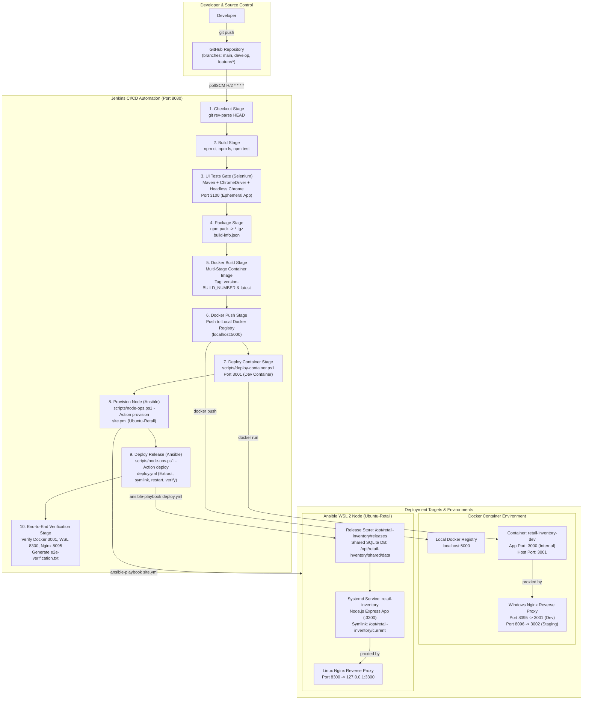

# Retail Inventory Alert Dashboard

A resilient, containerized, full-stack retail inventory and replenishment tracking system built with Node.js, Express, EJS, and SQLite. Governed by an automated end-to-end DevOps pipeline integrating GitHub, Jenkins CI/CD, Selenium UI quality gates, Docker container registry and deployment, and Ansible configuration management and release deployment on WSL 2 (`Ubuntu-Retail`).

---

## 1. Feature List

- **Item Catalogue Management**: Create, update, list, and view retail items with SKU, name, category, price, and threshold parameters.
- **Stock Transactions & Validation**: Real-time recording of stock receipts (IN) and deductions (OUT), with strict server-side validation preventing negative balances or invalid stock deductions.
- **Search & Category Filtering**: Fast keyword search and multi-category filtering for rapid inventory lookup.
- **Automated Exception Alerts**: Dynamic status calculation marking items as **NORMAL**, **LOW STOCK**, or **OUT OF STOCK**, accompanied by dedicated exception alert dashboards.
- **RESTful API**: Comprehensive JSON endpoints (`/api/items`, `/api/transactions`, `/api/alerts`, `/health`) supporting headless consumption and monitoring.
- **Dual Continuous Deployment**: Simultaneous automated deployment to containerized Docker runtime environments and Ansible-managed Linux systemd service nodes.
- **Self-Healing Rollback**: Automated zero-downtime rollback to the last verified stable release upon deployment or health check failure.

---

## 2. End-to-End System Architecture



---

## 3. Quick Start

### Prerequisites
- Node.js (v20+ or v22 LTS recommended)
- npm (v10+)
- Git

### Installation & Standalone Run
```bash
# 1. Clone the repository
git clone https://github.com/Rajit03/retail-inventory-alert-dashboard.git
cd retail-inventory-alert-dashboard

# 2. Install production and development dependencies
npm install

# 3. Seed SQLite database with initial inventory catalog
npm run seed

# 4. Start standalone development server
npm start
```
- Web Application: [http://localhost:3000](http://localhost:3000)
- Health Check: [http://localhost:3000/health](http://localhost:3000/health)

---

## 4. Environments & Port Allocation

| Port | Service / Environment | Host / Target | Role & Ingress Purpose |
| :--- | :--- | :--- | :--- |
| **3000** | Standalone Local Dev (`npm start`) | Windows Host | Direct local development and manual verification. |
| **3001** | Docker Container (`retail-inventory-dev`) | Docker Host Port | Development container runtime deployed from local registry. |
| **3002** | Docker Container (`retail-inventory-staging`) | Docker Host Port | Staging container runtime (optional / on-demand via parameter). |
| **3100** | Selenium Test App Instance | Windows Host | Ephemeral background application spawned during UI test gate. |
| **3200** | Manual Docker Demo (`ria-dev`) | Docker Host Port | Standalone manual container testing and demonstration sandbox. |
| **3300** | Ansible Node App Service | WSL 2 (`Ubuntu-Retail`) | Internal Express app service managed by systemd (`retail-inventory.service`). |
| **5000** | Local Docker Registry v2 | Docker Container | Private container registry storing versioned build images. |
| **8080** | Jenkins CI/CD Server | Windows Host | Automation server orchestrating the complete 10-stage delivery pipeline. |
| **8095** | Windows Nginx Dev Reverse Proxy | Windows Host | Production-like ingress proxy routing to dev container port `3001`. |
| **8096** | Windows Nginx Staging Proxy | Windows Host | Staging ingress proxy routing to staging container port `3002`. |
| **8300** | Linux Nginx Reverse Proxy | WSL 2 (`Ubuntu-Retail`) | Ingress proxy routing traffic to internal systemd service port `3300`. |

---

## 5. How to Run Tests

### Unit Tests
```bash
npm test
```
*Executes Mocha/Node test suites validating inventory calculation, transaction invariants, and data models.*

### Selenium WebDriver UI Tests
```powershell
# 1. Spawn test server instance on port 3100 in background
$env:PORT = "3100"
$env:DB_PATH = "data/test.db"
$env:NODE_ENV = "test"
node src/server.js &

# 2. Execute Selenium test suite via Maven
cd tests/selenium
mvn test -Dapp.url=http://localhost:3100
```
*Runs automated headless Chrome regression suites using the Page Object Model (POM) against the live application.*

---

## 6. CI/CD Pipeline Stages (Jenkinsfile)

The Jenkins pipeline executes automatically upon commits to `develop` via SCM polling (`pollSCM 'H/2 * * * *'`):

1. **Checkout**: Checks out revision, prints commit hash, branch, and active deployment parameters.
2. **Build**: Runs `npm ci`, verifies Express module integrity, and executes unit tests.
3. **UI Tests (Selenium)**: Spawns ephemeral test server on port 3100 with `JENKINS_NODE_COOKIE=dontKillMe`, executes headless Chrome Maven test suite as a blocking quality gate.
4. **Package**: Generates production release tarball (`*.tgz`) and writes immutable `build-info.json`.
5. **Docker Build**: Executes multi-stage Docker build with native C++ compilation for `better-sqlite3`, generating tags `${APP_VERSION}-${BUILD_NUMBER}` and `latest`.
6. **Docker Push**: Pushes built image tags to local private Docker registry (`localhost:5000`).
7. **Deploy Container**: Executes `scripts/deploy-container.ps1`: clears old container, clears port conflicts on host port `3001`, starts fresh container with persistent named volume, verifies published ports, and verifies `/health`.
8. **Provision Node (Ansible)**: Executes `scripts/node-ops.ps1 -Action provision`, running `ansible-playbook site.yml` in WSL `Ubuntu-Retail`.
9. **Deploy Release (Ansible)**: Executes `scripts/node-ops.ps1 -Action deploy`, unpacking `.tgz` into `/opt/retail-inventory/releases/b<N>`, pointing atomic symlink `/opt/retail-inventory/current`, restarting systemd service, and executing automated health checks with auto-rollback.
10. **End-to-End Verification**: Synthetic verification checking Docker (`:3001`), WSL (`:8300`), Items API, and Nginx proxy, outputting `e2e-verification.txt`.

---

## 7. Preflight Verification & Demo Instructions

### Automated Preflight Check
Before demonstrating the system or triggering builds, verify that all daemons and prerequisites are running:
```powershell
powershell -ExecutionPolicy Bypass -File scripts\preflight.ps1
```
*Outputs a color-coded table confirming Docker engine, registry, Jenkins, WSL 2 `Ubuntu-Retail`, systemd services, container ports, and health endpoints.*

### Running the Live Demonstration
Follow the 12-minute timed walkthrough documented in [docs/demo-runbook.md](file:///c:/Projects/retail-inventory-alert-dashboard/docs/demo-runbook.md):
1. Review Git branches and architecture.
2. Create feature branch, make a visible UI change, push, and open Pull Request.
3. Merge Pull Request into `develop` and observe automatic Jenkins build initiation.
4. Walk through the 10-stage execution in Jenkins Stage View.
5. Inspect passing Selenium test results and quality gate.
6. Verify live container release at [http://localhost:3001/items](http://localhost:3001/items).
7. Verify live Ansible WSL release at [http://localhost:8300/items](http://localhost:8300/items).
8. (Optional) Demonstrate automatic zero-downtime rollback via `node-ops.ps1 -Action rollback`.

---

## 8. Documentation Index

Comprehensive engineering documents located under `docs/`:

- [docs/architecture.md](file:///c:/Projects/retail-inventory-alert-dashboard/docs/architecture.md) — System architecture, Mermaid delivery diagrams, and port map.
- [docs/troubleshooting-guide.md](file:///c:/Projects/retail-inventory-alert-dashboard/docs/troubleshooting-guide.md) — Diagnosis matrix for 17 real operational issues and Jenkins stage failure triage.
- [docs/limitations-and-future-enhancements.md](file:///c:/Projects/retail-inventory-alert-dashboard/docs/limitations-and-future-enhancements.md) — Honest analysis of local limitations and prioritized future roadmap.
- [docs/demo-runbook.md](file:///c:/Projects/retail-inventory-alert-dashboard/docs/demo-runbook.md) — 12-minute timed presentation script and pre-flight checklist.
- [docs/viva-qa.md](file:///c:/Projects/retail-inventory-alert-dashboard/docs/viva-qa.md) — 30 comprehensive technical viva questions and answers.
- [docs/pipeline-setup.md](file:///c:/Projects/retail-inventory-alert-dashboard/docs/pipeline-setup.md) — Jenkins declarative pipeline reference and parameters.
- [docs/docker-lifecycle.md](file:///c:/Projects/retail-inventory-alert-dashboard/docs/docker-lifecycle.md) — Multi-stage Dockerfile design and registry management.
- [docs/configuration-specification.md](file:///c:/Projects/retail-inventory-alert-dashboard/docs/configuration-specification.md) — Ansible roles, Jinja2 templates, and systemd specs.
- [docs/reliability-validation.md](file:///c:/Projects/retail-inventory-alert-dashboard/docs/reliability-validation.md) — Idempotency and fault-injection rollback test logs.
- [docs/selenium-test-plan.md](file:///c:/Projects/retail-inventory-alert-dashboard/docs/selenium-test-plan.md) — Selenium POM architecture and test plan.
- [docs/ci-setup.md](file:///c:/Projects/retail-inventory-alert-dashboard/docs/ci-setup.md) — Initial CI service configuration guide.
- [docs/task14/summary.md](file:///c:/Projects/retail-inventory-alert-dashboard/docs/task14/summary.md) — Task 14 Ansible provisioning and rollback experiment logs.
- [docs/release-notes-v2.0.0.md](file:///c:/Projects/retail-inventory-alert-dashboard/docs/release-notes-v2.0.0.md) — Final v2.0.0 DevOps release notes.
- [docs/README.md](file:///c:/Projects/retail-inventory-alert-dashboard/docs/README.md) — One-line index of all documentation files.

---

## 9. Repository Structure

```text
retail-inventory-alert-dashboard/
├── .gitattributes              # LF line-ending enforcement for Linux files
├── .gitignore                  # Ignore rules for logs, node_modules, *.db, *.tgz
├── Dockerfile                  # Multi-stage production container image definition
├── Jenkinsfile                 # Declarative 10-stage CI/CD pipeline definition
├── README.md                   # Project overview, quick start, and documentation index
├── package.json                # Node.js project manifest and dependency declarations
├── package-lock.json           # Locked dependency dependency graph
│
├── ansible/                    # Ansible configuration management for WSL node
│   ├── ansible.cfg             # Configuration targeting WSL local connection
│   ├── site.yml                # Master provisioning playbook
│   ├── deploy.yml              # Atomic release deployment playbook
│   ├── healthcheck.yml         # Endpoint and service healthcheck playbook
│   ├── rollback.yml            # Automated and manual rollback playbook
│   ├── teardown.yml            # Environment cleanup playbook
│   ├── inventory/              # Host inventory definitions and group vars
│   └── roles/                  # Ansible modular roles (common, nginx, release)
│
├── deploy/                     # Host configuration artifacts
│   └── nginx/                  # Windows Nginx reverse proxy configurations
│
├── docs/                       # Comprehensive architectural and operational docs
│   ├── architecture.md
│   ├── troubleshooting-guide.md
│   ├── limitations-and-future-enhancements.md
│   ├── demo-runbook.md
│   ├── viva-qa.md
│   ├── README.md
│   └── task14/
│
├── public/                     # Static client assets (CSS styling)
├── scripts/                    # Automation and lifecycle scripts
│   ├── deploy-container.ps1    # Container deployment with port conflict cleanup
│   ├── ensure-registry.ps1     # Docker registry startup script
│   ├── node-ops.ps1            # Location-independent Ansible wrapper for WSL
│   └── preflight.ps1           # System-wide preflight health validation
│
├── src/                        # Express application source code
│   ├── app.js                  # Express middleware and routing initialization
│   ├── server.js               # Application server entry point
│   ├── db/                     # SQLite schema and seed scripts
│   ├── routes/                 # Express route controllers (items, transactions, alerts)
│   ├── utils/                  # Helper utilities and stock calculation
│   ├── validators/             # Request payload validation functions
│   └── views/                  # EJS server-rendered templates
│
└── tests/                      # Automated test suites
    ├── unit/                   # Mocha unit tests for business logic
    └── selenium/               # Maven + Java Selenium WebDriver UI test suite
```