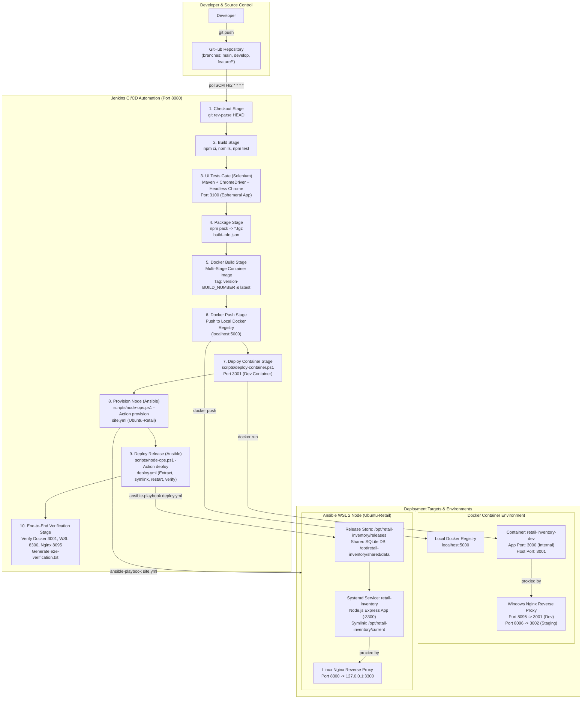

# System Architecture & End-to-End Release Pipeline

## 1. Overview

The **Retail Inventory Alert Dashboard** is a full-stack Node.js, Express, EJS, and SQLite retail inventory management web application with integrated automated alert triggers. The application lifecycle is governed by an enterprise-grade CI/CD and Configuration Management pipeline hosted on Windows with WSL 2 (`Ubuntu-Retail`), integrating:
- **Source Control**: GitHub repository with strict Git branching policies.
- **Continuous Integration**: Jenkins Pipeline executing on a self-hosted Windows agent with automated SCM polling (`pollSCM`), dependency verification, unit tests, and Selenium WebDriver UI quality gate.
- **Packaging & Containerization**: NPM release tarballs, multi-stage Docker image builds with local registry distribution (`localhost:5000`), containerized deployment (`retail-inventory-dev`), and reverse proxy ingress (Windows Nginx on `8095`).
- **Configuration Management & Bare-Metal Deployment**: Ansible provisioning and zero-downtime release deployment onto a dedicated WSL 2 Linux node (`Ubuntu-Retail`), utilizing systemd services, automated schema migrations/seeding, reverse proxy routing (Linux Nginx on `8300` -> `3300`), and automatic rollbacks upon health check failure.
- **End-to-End Verification**: Multi-target automated synthetic validation asserting container status, port publication, direct service health, reverse proxy routing, and REST API availability across all deployed environments.

---

## 2. End-to-End Architecture & Delivery Flow

---

## 3. System Components Inventory

| Component | Technology / Tool | Version | Role in Architecture |
| :--- | :--- | :--- | :--- |
| **Application Core** | Node.js / Express | Node 22.x / Express 4.x | REST API, dynamic server-side templating (EJS), business rules & alerts. |
| **Database Engine** | SQLite (`better-sqlite3`) | v11.x | File-based transactional relational storage with schema migrations and seed data. |
| **Source Control** | Git & GitHub | Git 2.x | Distributed version control, branch protection, pull request reviews. |
| **CI Automation** | Jenkins Pipeline | Jenkins 2.x (Agent: Local Windows) | Pipeline orchestrator, executing automated builds, tests, container releases, and Ansible triggers. |
| **UI Testing Gate** | Selenium WebDriver + JUnit | Selenium 4.x / Maven 3.9.x / JDK 21 | Automated headless Chrome browser testing gate validating full CRUD and alert UX workflows. |
| **Container Engine** | Docker Desktop | Docker Engine 29.x | Multi-stage image packaging, layer caching, local container management, volume mounting. |
| **Image Registry** | Docker Registry v2 | v2.8+ | Private container registry at `localhost:5000` storing versioned application images. |
| **Windows Ingress** | Nginx for Windows | Nginx 1.28.x | Reverse proxy routing incoming requests from ports `8095` (dev) and `8096` (staging) to container ports. |
| **Linux Node** | WSL 2 (`Ubuntu-Retail`) | Ubuntu 24.04 LTS (WSL 2) | Dedicated Linux execution target running systemd, Node.js, and Nginx. |
| **Configuration Mgmt** | Ansible | Ansible Core 2.20.x | Idempotent system configuration, role-based provisioning, release lifecycle, atomic symlink switching, and automatic rollbacks. |
| **Linux Ingress** | Linux Nginx | Nginx 1.24.x | Reverse proxy routing incoming requests from port `8300` to internal app service port `3300`. |

---

## 4. Environment & Network Port Mapping

| Port | Service / Component | Host / Target | Protocol | Purpose & Accessibility |
| :--- | :--- | :--- | :--- | :--- |
| **3000** | Local Development (`npm start`) | Windows Host | HTTP | Direct developer standalone execution during local coding. |
| **3001** | Docker Container (`retail-inventory-dev`) | Docker Host Port | HTTP | Dev containerized instance running image `localhost:5000/retail-inventory-alert:<tag>`. |
| **3002** | Docker Container (`retail-inventory-staging`) | Docker Host Port | HTTP | Staging containerized instance (optional, deployed on-demand). |
| **3100** | Selenium Test Instance | Windows Host | HTTP | Ephemeral background application instance spawned during Jenkins UI test stage. |
| **3200** | Manual Docker Demo | Docker Host Port | HTTP | Standalone manual container testing and demo instance. |
| **3300** | Ansible Node App Service | WSL 2 (`Ubuntu-Retail`) | HTTP | Internal Express app service managed by systemd (`retail-inventory.service`). |
| **5000** | Local Docker Registry | Docker Container | HTTP | Private Docker registry container exposing API v2 catalog and tag storage. |
| **8080** | Jenkins CI Server | Windows Host | HTTP | Jenkins CI/CD web dashboard and pipeline automation orchestrator. |
| **8095** | Windows Nginx Dev Reverse Proxy | Windows Host | HTTP | Production-like ingress proxy forwarding to dev container port `3001`. |
| **8096** | Windows Nginx Staging Reverse Proxy | Windows Host | HTTP | Staging ingress proxy forwarding to staging container port `3002`. |
| **8300** | Linux Nginx Reverse Proxy | WSL 2 (`Ubuntu-Retail`) | HTTP | Production-like ingress proxy forwarding to systemd app service port `3300`. |

---

## 5. Release Artefacts & Data Flow

1. **Package Tarball (`.tgz`)**:
   - Generated during the `Package` stage via `npm pack`.
   - Contains production source files (`src/`, `public/`, `package.json`, `package-lock.json`, `README.md`, `build-info.json`).
   - Excludes developer artifacts, test files, and local databases.
   - Used by Ansible release deployment on the WSL node.

2. **Docker Image Tags (`localhost:5000/retail-inventory-alert`)**:
   - Built using multi-stage `Dockerfile` with native build toolchains for `better-sqlite3`.
   - Immutable version tag: `${APP_VERSION}-${BUILD_NUMBER}` (e.g., `1.0.0-15`).
   - Floating tag: `latest`.
   - Annotated with metadata labels `build.number` and `git.commit`.

3. **Ansible Release Filesystem Structure (`/opt/retail-inventory`)**:
   - `/opt/retail-inventory/releases/<release_id>`: Individual immutable extracted release folders with isolated production dependencies (`node_modules/`).
   - `/opt/retail-inventory/shared/data`: Persistent storage directory hosting the active `inventory.db` SQLite database, shared across releases.
   - `/opt/retail-inventory/current`: Active atomic symlink pointing to the running release (e.g., `-> /opt/retail-inventory/releases/b15`).
   - `/opt/retail-inventory/stable`: Pointer to the last known healthy, verified release.
   - `/opt/retail-inventory/previous`: Pointer to the pre-existing release prior to deployment, enabling instant one-step rollback.

---

## 6. Git Branching Model & Delivery Strategy

- **`main`**: Production-ready releases. Only updated via pull requests from `develop` accompanied by release tags.
- **`develop`**: Integration branch containing verified features. All pull requests are merged here after passing pipeline verification.
- **`feature/<name>`**: Isolated feature branches branched from `develop` (e.g., `feature/final-release`).
- **Pipeline Trigger**: Jenkins monitors `develop` via `pollSCM('H/2 * * * *')`. When changes are detected, a full automated build and verification run is executed.
