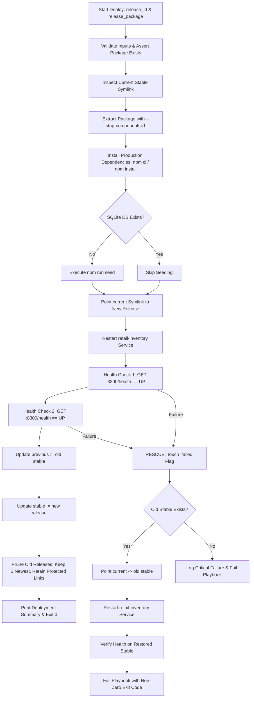

# Reliability & Release Management Architecture

This document details the architecture, automated deployment pipeline, verification strategy, fault tolerance mechanisms, and rollback procedures implemented in Ansible and PowerShell for the Retail Inventory Alert Dashboard (Task 14).

---

## 1. Directory Structure & Symlink Pointer Model

All releases and persistent state reside under `/opt/retail-inventory`, owned by the unprivileged `retailapp` system user:

```text
/opt/retail-inventory/
├── current -> /opt/retail-inventory/releases/<active_release_id>
├── stable  -> /opt/retail-inventory/releases/<last_verified_release_id>
├── previous-> /opt/retail-inventory/releases/<prior_stable_release_id>
├── releases/
│   ├── r1/
│   ├── r2/
│   └── <release_id>/ (.failed flag present if corrupted/failed)
├── shared/
│   └── data/
│       └── inventory.db (persistent SQLite database preserved across releases)
├── .npm/ (isolated npm cache writable by retailapp)
└── /var/log/retail-inventory/
    ├── app.log (stdout)
    └── err.log (stderr)
```

### Symlink Pointer Semantics

| Symlink Pointer | Target Definition | Updated When |
| :--- | :--- | :--- |
| `current` | The currently running release directory executed by systemd | Set to candidate release during deployment; restored to `stable` on failure |
| `stable` | The most recent release that **passed all health checks** | Updated upon successful verification of candidate release |
| `previous` | The stable release preceding the active stable release | Shifted when a new stable release is promoted |

---

## 2. Automated Deployment Workflow

The deployment process is defined in [`ansible/deploy.yml`](../ansible/deploy.yml) and executed by [`ansible/roles/release`](../ansible/roles/release):



### Key Deployment Steps

1. **Parameter Validation**: Asserts `release_id` and `release_package` are non-empty and accessible.
2. **Pre-Deploy Snapshot**: Records `old_stable_path` and `old_stable_exists`.
3. **Extraction & Dependencies**: Extracts `.tgz` archive skipping if already extracted, runs `npm ci --omit=dev` (or `npm install --omit=dev` when lockfile is omitted) utilizing an isolated `npm_cache_dir` (`/opt/retail-inventory/.npm`).
4. **Conditional Seeding**: Runs `npm run seed` only when `/opt/retail-inventory/shared/data/inventory.db` does not exist.
5. **Atomic Switch & Service Restart**: Points `current` symlink to candidate release directory and restarts the `retail-inventory` systemd service.
6. **Double-Layered Health Checks**: Queries direct app port (`:3300/health`) and reverse proxy port (`:8300/health`) with exponential retries.
7. **Promotion & Retention Pruning**: Promotes `stable` and `previous` symlinks, discovers release directories, sorts by modification time, and removes older releases while protecting targets of `current`, `stable`, and `previous`.

---

## 3. Automated Failure Recovery & Rollback

### Automated Rollback (Ansible `rescue` block)
When any step in the deployment block fails (including health check non-200 or unexpected payload):
1. An immutable marker `.failed` is created in `/opt/retail-inventory/releases/<release_id>/.failed`.
2. The `current` symlink is immediately repointed back to `old_stable_path`.
3. The application service is restarted on the restored stable release.
4. Health checks verify the restored stable release is operational.
5. The Ansible play intentionally exits with non-zero exit code (`failed=1`), preventing CI/CD pipelines from falsely passing broken builds.

### Manual Rollback ([`ansible/rollback.yml`](../ansible/rollback.yml))
Operators can manually trigger rollbacks at any time:
- By default, rolls back to `previous`.
- Optionally accepts `-e target_release=<release_id>`.
- Asserts target release exists and is **not** flagged with `.failed`.
- Updates `current` and `stable` symlinks, restarts systemd, and validates health.

---

## 4. Idempotency Principles

Every Ansible task strictly adheres to Ansible idempotency best practices:
- **Directory & Symlink Management**: Uses `ansible.builtin.file` with declared state (`directory`, `link`). Existing links pointing to target remain untouched (`changed=0`).
- **Archive Extraction**: Checks for package existence prior to unarchiving with `stat`.
- **Dependency Installation**: Uses `command` with `creates: .../node_modules`.
- **Database Seeding**: Checks for `inventory.db` existence before executing seed.
- **Service State**: Employs conditionals checking whether symlink changed before triggering restarts.

---

## 5. Teardown Safety Guard

To prevent accidental node destruction in multi-node or production environments, [`ansible/teardown.yml`](../ansible/teardown.yml) enforces strict runtime guard conditions:
1. **Mandatory Explicit Variable**: Requires `-e confirm_teardown=yes`.
2. **Inventory Target Assertion**: Must match target node `retail-node`.
3. **Safe Cleanup**: Purges `nginx`, `nodejs`, unit files, user `retailapp`, and `/opt/retail-inventory`, but preserves base tooling (`ansible`, `git`, `curl`, `python3`, `build-essential`).
4. **Clean Verification**: Asserts package absence, user absence, and free ports before exit.

---

## 6. How to Run Operations with `scripts/node-ops.ps1`

The PowerShell wrapper [`scripts/node-ops.ps1`](../scripts/node-ops.ps1) orchestrates all node management operations across Windows and WSL:

### 1. Provision Node (Site Playbook)
```powershell
powershell -File scripts/node-ops.ps1 -Action provision
```

### 2. Deploy Release (Package & Deploy)
```powershell
# Automatically runs 'npm pack' and deploys as release 'r1'
powershell -File scripts/node-ops.ps1 -Action deploy -ReleaseId r1

# Deploy an existing tarball
powershell -File scripts/node-ops.ps1 -Action deploy -ReleaseId r2 -PackagePath "C:\path\to\package.tgz"
```

### 3. Run System Health Check
```powershell
powershell -File scripts/node-ops.ps1 -Action healthcheck
```

### 4. Rollback Release
```powershell
# Rollback to 'previous'
powershell -File scripts/node-ops.ps1 -Action rollback

# Rollback to specific release
powershell -File scripts/node-ops.ps1 -Action rollback -TargetRelease r1
```

### 5. Teardown & Reset Node
```powershell
powershell -File scripts/node-ops.ps1 -Action teardown
```
